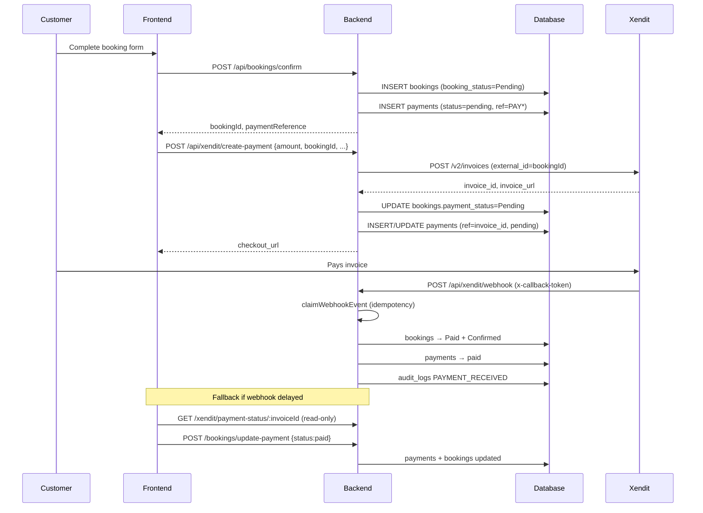
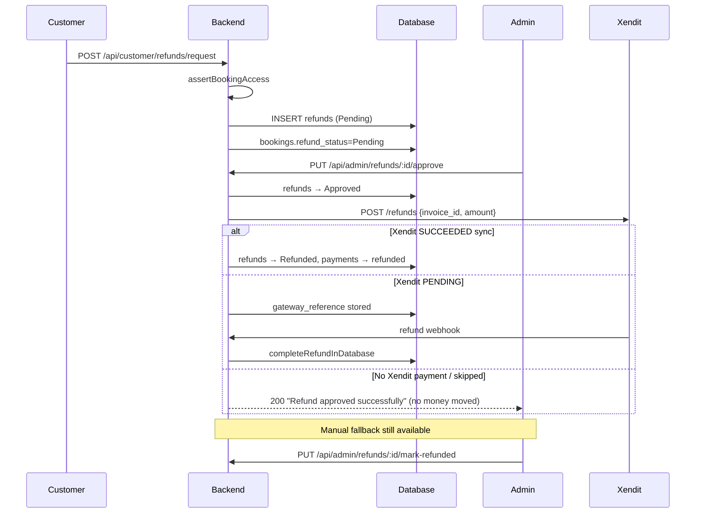

# PAYMENT_ARCHITECTURE_AUDIT.md

# Reservision Payment Architecture Audit

**Payment Provider (stated business rule):** Xendit  
**Payment Providers (actual code):** Xendit + PayMongo (dual gateway)  
**Audit Date:** June 2026  
**Audit Scope:** End-to-end payment, refund, booking, and webhook flows  
**Method:** Route → controller → service → database → Xendit API → webhook → final state (code inspection only)

---

# Executive Summary

The codebase implements **Xendit invoice payments and automated Xendit refunds on admin approval**, but diverges significantly from the documented business rules. **PayMongo remains fully wired** alongside Xendit. The highest-risk gap is **`POST /api/bookings/update-payment`**, which is public and can mark bookings paid without gateway proof.

| Area | Expected | Actual | Match |
|------|----------|--------|-------|
| Sole gateway Xendit | Yes | Xendit + PayMongo | **NO** |
| Webhook token validation | Yes | Xendit only | **PARTIAL** |
| Amount verification on webhook | Yes | Not implemented | **NO** |
| Booking confirmed only after payment | Yes | Bypass via `update-payment` | **NO** |
| Failed payment → Cancelled + Expired | Yes | `payment_status=Failed` only | **NO** |
| Auto Xendit refund on approve | Yes | Yes, when Xendit payment exists | **PARTIAL** |
| Refund completion without manual step | Yes | `mark-refunded` still exists | **PARTIAL** |
| Customer email on refund complete | Yes | Not found in code | **NO** |

**Final verdict:** Not production-ready for financial operations without remediation (see Section 5).

---

# 1. Architecture Diagram (Actual)

```mermaid
flowchart TB
    subgraph Frontend
        FE1[ConfirmationBooking / POS / PaymentReturn]
    end

    subgraph API["Express API (server.js)"]
        B["/api/bookings/*<br/>requireBookingAuth + public exceptions"]
        X["/api/xendit/*<br/>NO auth middleware"]
        P["/api/paymongo/*<br/>NO auth middleware"]
        W["/api/webhooks/paymongo"]
        AR["/api/admin/refunds/*<br/>requireAdminAuth"]
        CR["/api/customer/refunds/*<br/>authenticateToken"]
    end

    subgraph Controllers
        BCC[bookingConfirmationController]
        XC[xenditController]
        PC[paymongoController]
        WC[webhookController]
        ARC[adminRefundController]
        XRS[xenditRefundService]
    end

    subgraph DB[(MySQL)]
        BK[bookings]
        PY[payments]
        RF[refunds]
        WE[webhook_events]
        AL[audit_logs]
    end

    subgraph External
        XA[Xendit API v2/invoices + /refunds]
        PMA[PayMongo API]
    end

    FE1 -->|POST /bookings/confirm| B --> BCC --> BK
    BCC --> PY
    FE1 -->|POST /xendit/create-payment| X --> XC --> XA
    FE1 -->|POST /paymongo/create-payment-link| P --> PC --> PMA
    FE1 -->|POST /bookings/update-payment| B --> BCC
    XA -->|POST /xendit/webhook + x-callback-token| X --> XC
    PMA -->|POST /paymongo/webhook| P --> PC
    PMA -->|POST /webhooks/paymongo| W --> WC
    XC --> WE
    XC --> BK
    XC --> PY
    XC --> AL
    CR --> ARC
    AR --> ARC --> XRS --> XA
    XRS --> RF
    XRS --> BK
    XRS --> PY
```

### Route map (evidence)

| Route | Auth | File |
|-------|------|------|
| `POST /api/bookings/confirm` | Public | `middleware/authenticateToken.js` L38–41 |
| `POST /api/bookings/update-payment` | Public + CSRF exempt | `authenticateToken.js` L40; `middleware/csrf.js` L21 |
| `POST /api/xendit/create-payment` | **None** | `server.js` L212 |
| `POST /api/xendit/webhook` | `verifyXenditWebhook` | `routes/xendit.js` L18 |
| `GET /api/xendit/payment-status/:invoiceId` | **None** | `routes/xendit.js` L15 |
| `POST /api/paymongo/create-payment-link` | **None** | `server.js` L215 |
| `POST /api/paymongo/webhook` | **None** | `routes/paymongo.js` L22 |
| `POST /api/webhooks/paymongo` | **None** | `routes/webhooks.js` L10 |
| `POST /api/customer/refunds/request` | `authenticateToken` + ownership | `customerRefundController.js` L25 |
| `PUT /api/admin/refunds/:id/approve` | Admin auth | `server.js` L246–247 |

---

# 2. Flow Diagram (Actual End-to-End)

## 2A. Reservation payment (Xendit path)



**Evidence files:** `bookingConfirmationController.js` L224–225, L590–602; `xenditController.js` L165–312, L44–123, L373–427; `PaymentReturn.vue` L204–224.

## 2B. Refund path (Xendit)



**Evidence files:** `customerRefundController.js`; `adminRefundController.js` L446–591, L657+; `xenditRefundService.js`; `routes/adminRefundRoutes.js` L24.

---

# 3. Expected vs Actual — Payment Flow

## Booking creation

| Expected | Actual | Evidence |
|----------|--------|----------|
| Booking status `Pending Payment` | `booking_status = 'Pending'` | `bookingConfirmationController.js` L224–225 |
| Payment status `Pending` | `payments.status = 'pending'`; `bookings.payment_status` often unset (defaults `Unpaid`) | L590–602; schema `bookings.sql` L45 |

## Xendit invoice creation

| Expected field | Stored? | Location |
|----------------|---------|----------|
| `invoice_id` | Yes | `payments.payment_reference` | `xenditController.js` L275 |
| `invoice_url` | Yes | `payments.checkout_url` | L281 |
| `external_id` | Sent to Xendit as `String(bookingId)` | L204 |
| `amount` | From **request body**, not DB | L191–205 |

**Gap:** Amount is client-supplied; no `SELECT total FROM bookings WHERE booking_id = ?` validation.

## Successful payment webhook

| Expected check | Implemented? | Evidence |
|----------------|--------------|----------|
| `x-callback-token` | **YES** | `middleware/xenditWebhookVerification.js` L23–47 |
| Invoice status | **YES** (`status === 'PAID'`) | `xenditController.js` L402 |
| Amount match | **NO** | `processPaidInvoiceWebhook` does not compare `payment.amount` to `bookings.total` |
| Invoice id | Used as `payment_reference` | L92 |

| Expected update | Actual |
|-----------------|--------|
| `booking_status = Confirmed` | **YES** — `xenditController.js` L65 |
| `payment_status = Paid` | **YES** — L68 (`bookings.payment_status`) |
| `paid_at` | **YES** — `payments.paid_at` L98 |
| `payment_reference` / invoice id | **YES** — L92 |

## Failed / expired payment

| Expected | Actual | Evidence |
|----------|--------|----------|
| Booking → `Cancelled` | **NO** — booking_status unchanged | `processFailedInvoiceWebhook` L127–132 |
| Payment → `Expired` | **NO** — sets `bookings.payment_status = 'Failed'` | L132; `payments.status` not updated |
| `payments.status = expired` | **Never set** in controllers | grep across controllers |

---

# 4. Expected vs Actual — Refund Flow

| Step | Expected | Actual | Match |
|------|----------|--------|-------|
| Request creates `refund_request` Pending | `refunds` row, `refund_status='Pending'` | **YES** | `adminRefundController.js` L382–414 |
| Approve → trigger Xendit automatically | `processApprovedRefundViaXendit` on approve | **PARTIAL** — skipped if no Xendit `payment_reference` | `xenditRefundService.js` L180–183 |
| Status `Processing` | Not in schema; stays `Approved` until `Refunded` | **NO** |
| Status `Completed` | Uses `Refunded` | **Naming mismatch** |
| Payment `Refunded` | **YES** on completion | `xenditRefundService.js` L135, L143–148 |
| Booking `Refunded` | Sets `payment_status='Refunded'`; `booking_status` → `Cancelled` or `Partially Refunded` | **PARTIAL** — not literal `Refunded` booking_status |
| Email + in-app notification | Admin notified on **request** only | `adminNotificationController.js` L34–56; **no refund-complete email** in `emailService.js` |
| Failure → `Failed` + retry | Xendit API error → 502; `gateway_status='FAILED'` | **PARTIAL** — no `refund_status='Failed'` enum value |
| No manual "Mark Refunded" | Route still exists | `routes/adminRefundRoutes.js` L24 — **FAIL** |

### Refund audit questions (answered)

1. **Does approval auto-trigger Xendit?** Yes, when `payments.payment_gateway='xendit'` and `payment_reference` exists (`xenditRefundService.js` L180–189).
2. **Is money returned after approval?** Only if Xendit API succeeds or webhook completes; otherwise approval can succeed with `skipped: true`.
3. **Admin intervention after approval?** Sometimes required via `mark-refunded` for non-Xendit or stuck refunds.
4. **Completion tied to webhook?** For async Xendit status: yes (`handleXenditRefundWebhook`); sync `SUCCEEDED` completes immediately (`L200–208`).
5. **Duplicate refund webhooks?** Refund webhooks use `claimWebhookEvent` when `body.event` includes `refund` (`xenditController.js` L377–383); `completeRefundInDatabase` idempotent if already `Refunded` (`xenditRefundService.js` L102–104).

---

# 5. Payment Audit Questions (answered)

### 1. Can a booking become confirmed without payment?

**YES — Critical.**

- `POST /api/bookings/update-payment` is public (`authenticateToken.js` L38–41).
- Body `{ bookingId, paymentReference, status: 'paid' }` updates DB without verifying Xendit (`bookingConfirmationController.js` L686–706).
- Called from `PaymentReturn.vue` L214–224 after client-side poll.

### 2. Can duplicate webhooks double-confirm bookings?

**Xendit: Mitigated but flawed.** `claimWebhookEvent` runs before processing (`xenditController.js` L396–403). If first attempt fails after claim, retries return `duplicate: true` and payment may never apply.

**PayMongo: YES risk.** No `webhook_events`; two webhook routes (`paymongo.js`, `webhooks.js`).

### 3. Can expired invoices still be paid?

Xendit may accept payment until expiry; code does not block `create-payment` on expired bookings. No server-side expiry lock on booking before new invoice.

### 4. Are payment amounts verified?

**NO.** `createPayment` trusts `req.body.amount` (`xenditController.js` L191–205). Webhook does not compare `payment.amount` to `bookings.total`.

---

# 6. Database Review

## `bookings`

| Field (schema) | Code usage issues |
|----------------|-------------------|
| `booking_status` ENUM | Code sets `Partially Refunded`, `confirmed` (legacy webhook) — not in ENUM |
| `payment_status` ENUM | Code uses `Pending`, `Failed`, `paid` (lowercase) — drift |
| `refund_status`, `refund_amount` | Added at runtime (`server.js` L387–390) — second refund truth |
| Missing | `xendit_invoice_id` dedicated column (uses `payments.payment_reference`) |
| Indexes | `booking_reference`, `booking_status` present in schema |

## `payments`

| Issue | Evidence |
|-------|----------|
| `payment_reference` UNIQUE, not `booking_id` UNIQUE | Multiple rows per booking possible |
| `payment_method` ENUM may reject Xendit values | `selectedPaymentMethod` can be `'xendit'` string (`xenditController.js` L277) |
| No `invoice_url` vs `checkout_url` consistency | Column `checkout_url` |
| FK `booking_id` | Present in `complete_booking_setup.sql` L85 |

## `refunds`

| Field | Notes |
|-------|-------|
| `refund_status` | ENUM: Pending, Approved, Rejected, Refunded — no Processing/Failed/Completed |
| `gateway_reference`, `gateway_status` | Present |
| Missing | `failure_reason` column |
| FK | `booking_id` → `bookings` (`server.js` L378) |

## `webhook_events`

| Field | Notes |
|-------|-------|
| `event_id` UNIQUE | Used only by Xendit path |
| Missing | Link to `booking_id` / `payment_id` for reconciliation |

## `audit_logs`

| Coverage | Gaps |
|----------|------|
| Xendit PAYMENT_RECEIVED/FAILED | `xenditController.js` |
| Refund admin actions | `adminRefundController.js` |
| Missing | PayMongo webhooks, `update-payment`, invoice creation |

---

# 7. Security Review

## Webhooks

| Control | Xendit | PayMongo |
|---------|--------|----------|
| Signature / token validation | **PASS** — `x-callback-token` required | **FAIL** — no verification |
| Replay protection | **PARTIAL** — `webhook_events` claim-before-process | **FAIL** |
| Idempotency | **PARTIAL** — poison-pill on processing error | **FAIL** |

## Payments

| Control | Status |
|---------|--------|
| Amount tampering prevention | **FAIL** — client amount |
| Invoice ownership validation | **FAIL** — `create-payment` unauthenticated |
| Booking ownership validation | **FAIL** on payment creation |

## Refunds

| Control | Status |
|---------|--------|
| Customer owns booking | **PASS** — `assertBookingAccess` (`customerRefundController.js` L25) |
| Refund amount validation | **PASS** on approve (`adminRefundController.js` L481–504) |
| Double refund prevention | **PARTIAL** — status checks; manual `mark-refunded`; concurrent approve race |

---

# 8. Vulnerability Report

## Critical

| ID | Finding | Location |
|----|---------|----------|
| C-01 | Public `update-payment` marks bookings paid without gateway proof | `bookingConfirmationController.js` L686–706; `authenticateToken.js` L40 |
| C-02 | Xendit idempotency claims event before success; failed processing blocks retries | `xenditController.js` L396–427; `idempotency.js` L23–33 |
| C-03 | PayMongo webhooks unauthenticated — forged payment confirmation | `paymongoController.js` L243; `webhookController.js` L17 |

## High

| ID | Finding | Location |
|----|---------|----------|
| H-01 | Payment amount not validated against booking total | `xenditController.js` L191–205 |
| H-02 | Multiple payment rows per booking | `bookingConfirmationController.js` L590 + `xenditController.js` L254 |
| H-03 | Dual PayMongo webhook endpoints, no idempotency | `routes/paymongo.js`, `routes/webhooks.js` |
| H-04 | `create-payment` endpoints have no authentication | `server.js` L212–215 |
| H-05 | Refund approve succeeds without Xendit execution when gateway skipped | `xenditRefundService.js` L180–183; `adminRefundController.js` L577–581 |
| H-06 | Status ENUM drift causes silent SQL issues / wrong reporting | Multiple controllers |

## Medium

| ID | Finding | Location |
|----|---------|----------|
| M-01 | `update-payment` sets `booking_status='Pending'` when paid | `bookingConfirmationController.js` L705 |
| M-02 | Expired invoice does not cancel booking per business rules | `xenditController.js` `processFailedInvoiceWebhook` |
| M-03 | Manual `mark-refunded` undermines auto-refund policy | `adminRefundRoutes.js` L24 |
| M-04 | No customer email/notification on refund completion | No matches in `emailService.js` |
| M-05 | Legacy `webhookController.js` uses wrong columns (`b.id`) | `webhookController.js` L72–88 |
| M-06 | Concurrent refund approvals — no row lock | `adminRefundController.js` L458–523 |

## Low

| ID | Finding | Location |
|----|---------|----------|
| L-01 | Poll endpoints do not sync DB | `xenditController.js` L331–371 |
| L-02 | `getBookingDetails` join uses `b.id` | `bookingConfirmationController.js` L818 |
| L-03 | PayMongo still in production paths despite Xendit-only policy | `routes/paymongo.js`, frontend `ConfirmationBooking.vue` |

---

# 9. Architecture Scores

| Score | Value | Rationale |
|-------|-------|-----------|
| **Security** | **3.5 / 10** | Xendit webhook verified; public payment forgery; PayMongo open; no amount checks |
| **Reliability** | **4.5 / 10** | Idempotency poison pill; dual gateways; inconsistent status writes |
| **Production Readiness** | **4.0 / 10** | Core happy path works; financial integrity and refund UX incomplete |

**Composite (average): 4.0 / 10**

---

# 10. Final Verdict

```text
The current payment architecture is NOT production-ready.
```

### Why

1. **Confirmed bookings without payment** are possible via `POST /api/bookings/update-payment` with no server-side gateway verification.
2. **Business rule "Xendit only" is not true in code** — PayMongo routes, webhooks, and frontend paths remain active with weaker security.
3. **Amount integrity is not enforced** at invoice creation or webhook handling.
4. **Refund automation is partial** — approval can complete without money movement; manual `mark-refunded` remains; no customer refund notifications.
5. **Failed-payment behavior** does not match spec (no booking cancellation, no `expired` payment status).
6. **Sprint 4 controls apply to Xendit only** — PayMongo and `update-payment` are outside that hardening scope.

### Minimum blockers before production

1. Remove or secure `update-payment` (server-side Xendit verification only).
2. Validate invoice amount against `bookings.total` on create and webhook.
3. Fix idempotency to commit only after successful processing.
4. Disable or fully secure PayMongo if policy is Xendit-only.
5. Remove or gate `mark-refunded` when `gateway_reference` is set.
6. Align status ENUMs / normalization layer.
7. Add refund completion notifications.

---

# Appendix — Code Evidence Index

| Component | Path |
|-----------|------|
| Booking confirm | `controllers/bookingConfirmationController.js` |
| Update payment | `controllers/bookingConfirmationController.js` `updatePaymentStatus` |
| Xendit payment + webhook | `controllers/xenditController.js` |
| Xendit webhook auth | `middleware/xenditWebhookVerification.js` |
| Idempotency | `middleware/idempotency.js` |
| PayMongo | `controllers/paymongoController.js` |
| Legacy PayMongo webhook | `controllers/webhookController.js` |
| Xendit refunds | `services/xenditRefundService.js` |
| Admin refunds | `controllers/adminRefundController.js` |
| Customer refunds | `controllers/customerRefundController.js` |
| Public route rules | `middleware/authenticateToken.js` |
| CSRF exclusions | `middleware/csrf.js` |
| Schema | `schema/bookings.sql`, `schema/payments.sql`, `server.js` `ensureRefundsSchema` |
| Frontend payment return | `CAPSTONE_FRONTEND/reservision/src/views/PaymentReturn.vue` |

---

*Audit performed by static code analysis. Re-validate after remediation with integration tests against Xendit sandbox webhooks.*
