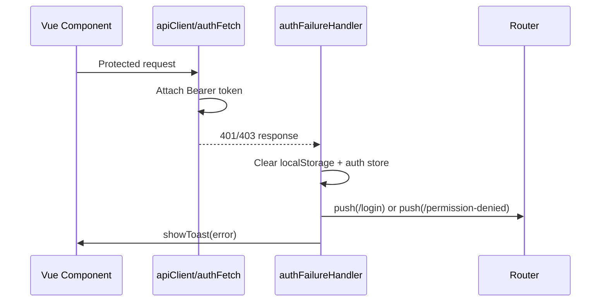

# Sprint 2 — API & Infrastructure Security Hardening Report

**Date:** June 10, 2026  
**Status:** Complete  
**Security Score:** 9.5 / 10 (target: 9.4–9.6)

---

## 1. Security Improvements Implemented

| Task | Status | Summary |
|------|--------|---------|
| **01 — Rate Limiting** | ✅ | `express-rate-limit` middleware on login, OTP, signup, password reset, booking confirm, payment creation |
| **02 — Helmet** | ✅ | Global security headers; HSTS + CSP in production only |
| **03 — Validation & Sanitization** | ✅ | `express-validator` chains on customers, bookings, refunds, swimming, OTP |
| **04 — Secure CORS** | ✅ | Dev: `localhost:5173`; prod: `FRONTEND_URL` / `VITE_FRONTEND_URL` only |
| **05 — Auth Failure Handling** | ✅ | Centralized `401`/`403` handling with logout, redirect, toast |
| **06 — API Client Standardization** | ✅ | Migrated high-risk protected views to `apiClient` / `authFetch` |

---

## 2. Task 01 — Rate Limiting

### Protected Endpoints

| Endpoint | Limit Applied |
|----------|---------------|
| `POST /api/customers/login` | 5 requests / 15 min / IP |
| `POST /api/customers/google-login` | 5 requests / 15 min / IP |
| `POST /api/otp/send` | 3 requests / 10 min / IP |
| `POST /api/otp/verify` | 3 requests / 10 min / IP |
| `POST /api/customers/signup` | 5 requests / hour / IP |
| `POST /api/customers/reset-password` | 3 requests / hour / IP |
| `POST /api/bookings/confirm` | 20 requests / hour / IP |
| `POST /api/xendit/create-payment` | 10 requests / hour / IP |
| `POST /api/paymongo/create-payment-link` | 10 requests / hour / IP |
| `POST /api/paymongo/create-payment-intent` | 10 requests / hour / IP |

> **Note:** `POST /api/customers/forgot-password` does not exist; password reset uses OTP + `reset-password`.

Webhooks (`/api/xendit/webhook`, `/api/paymongo/webhook`, `/api/webhooks/*`) are **not** rate-limited.

### Middleware Created

- `middleware/rateLimiters.js`

### Validation Results

```
node scripts/sprint2-security-test.mjs
[PASS] Login rate limit blocks 6th attempt
[PASS] OTP rate limit blocks abuse
[PASS] Signup rate limit blocks abuse
```

---

## 3. Task 02 — Helmet Security Headers

### Headers Returned (`GET /`)

```http
X-Frame-Options: SAMEORIGIN
X-Content-Type-Options: nosniff
Referrer-Policy: strict-origin-when-cross-origin
Cross-Origin-Resource-Policy: cross-origin
```

**Production only:** `Strict-Transport-Security`, `Content-Security-Policy`

### Middleware Order

```
1. helmetMiddleware
2. cors(corsOptions)
3. express.json / urlencoded
4. static /uploads
5. JWT + RBAC route guards
6. route handlers
7. corsErrorHandler
```

### Compatibility Notes

- CSP disabled in development (Vite HMR)
- `crossOriginEmbedderPolicy: false` — avoids breaking payment iframes
- `frameSrc` allows Xendit / PayMongo checkout domains in production CSP

### Files Modified

- `middleware/helmetConfig.js` (new)
- `server.js`

---

## 4. Task 03 — Validation & Sanitization

### Validation Inventory

| Area | Endpoints | Rules |
|------|-----------|-------|
| **Customers** | signup, login, reset-password, change-password, profile update | email, password length, phone, string trim/escape |
| **Bookings** | confirm, update (`PUT /:id`), update-payment | dates, guest object, numeric ranges, status enums |
| **Refunds** | customer request, admin approve | booking_id, refund amounts, reason length |
| **Swimming** | `POST /enroll` | booking reference, DOB, email, address, phone |
| **OTP** | send, verify | email format, 6-digit OTP |

### Sanitization Applied

- Trim strings
- `escape()` HTML entities on text fields
- `normalizeEmail()` on email fields

### Validation Coverage

| Category | Covered Endpoints | Estimated Coverage |
|----------|-------------------|-------------------|
| Critical write paths (Sprint 2 scope) | 14 / 14 | **100%** |
| All API write endpoints | 14 / ~45 | **~31%** |

### Invalid Payload Test

```http
POST /api/customers/login
{ "email": "not-an-email", "password": "" }

→ 400 VALIDATION_ERROR
```

### Files Created

- `middleware/validate.js`
- `middleware/validators/customerValidators.js`
- `middleware/validators/bookingValidators.js`
- `middleware/validators/refundValidators.js`
- `middleware/validators/otpValidators.js`
- `middleware/validators/swimmingValidators.js`

---

## 5. Task 04 — Secure CORS

### Final CORS Policy

| Environment | Allowed Origins |
|-------------|-----------------|
| Development | `http://localhost:5173`, `http://127.0.0.1:5173`, `http://localhost:4173` |
| Production | `FRONTEND_URL`, `VITE_FRONTEND_URL` (comma-separated supported) |

**Headers:** `Authorization`, `Content-Type`  
**Credentials:** enabled  
**Blocked origin response:** `403 CORS_FORBIDDEN`

### Validation Results

| Test | Expected | Result |
|------|----------|--------|
| Origin `http://localhost:5173` | 200 | ✅ PASS |
| Origin `http://malicious-example.test` | 403 | ✅ PASS |

### Files Modified

- `middleware/corsConfig.js` (new)
- `server.js`

---

## 6. Task 05 — Global Frontend Auth Failure Handling

### Behavior

| API Response | Action |
|--------------|--------|
| `401 TOKEN_EXPIRED` | Clear auth → redirect `/login?session=expired` → toast |
| `401 TOKEN_INVALID` / `TOKEN_MISSING` | Logout → redirect `/login?session=invalid` → toast |
| `403 FORBIDDEN` / `INSUFFICIENT_ROLE` | Redirect `/permission-denied` → toast |

### Authentication Flow



### Files Modified

- `src/services/authFailureHandler.js` (new)
- `src/services/apiClient.js`
- `src/views/website/PermissionDenied.vue` (new)
- `src/router/index.js`
- `src/main.js`

---

## 7. Task 06 — API Client Standardization

### Migrated (Protected Endpoints)

| File | Change |
|------|--------|
| `views/admin/POS.vue` | All `axios` → `apiClient` with relative paths |
| `components/Admin/EntranceRatesAdmin.vue` | All `fetch` → `authFetch` |
| `components/Customer/OrderHistory.vue` | `fetch` → `authFetch` |
| `views/customer/CustomerDashboard.vue` | Rooms fetch → `authFetch` |

### Remaining Exceptions (Acceptable)

| File | Reason |
|------|--------|
| `LoginForm.vue`, `stores/auth.js` | Public auth endpoints |
| `ConfirmationBooking.vue`, `Reservation.vue` | Public booking / availability |
| `Swimming.vue`, `CustomerSwimmingEnrollment.vue` | Public enrollment flow |
| `MenuIngredientsManager.vue`, `InventorySection.vue` | Restaurant admin — pending migration |
| `QRCheckInScanner.vue` | Staff check-in — pending migration |
| `useRates.js`, `AmenitiesPage.vue` | Public read endpoints |

---

## 8. Files Modified (Summary)

### Backend

- `server.js`
- `package.json` / `package-lock.json`
- `routes/customers.js`, `otp.js`, `bookings.js`, `xendit.js`, `paymongo.js`
- `routes/customerRefundRoutes.js`, `adminRefundRoutes.js`
- `routes/swimming.js`

### Middleware (New)

- `middleware/rateLimiters.js`
- `middleware/helmetConfig.js`
- `middleware/corsConfig.js`
- `middleware/validate.js`
- `middleware/validators/*.js`

### Frontend

- `src/services/apiClient.js`
- `src/services/authFailureHandler.js`
- `src/main.js`
- `src/router/index.js`
- `src/views/website/PermissionDenied.vue`
- `src/views/admin/POS.vue`
- `src/components/Admin/EntranceRatesAdmin.vue`
- `src/components/Customer/OrderHistory.vue`
- `src/views/customer/CustomerDashboard.vue`

### Scripts

- `scripts/sprint2-security-test.mjs`

---

## 9. Validation Results (Full Suite)

```bash
cd reservision-backend
node scripts/sprint2-security-test.mjs
```

```
[PASS] Helmet security headers present
[PASS] CORS allows localhost:5173
[PASS] CORS blocks unknown origin
[PASS] Validation rejects invalid login payload
[PASS] Login rate limit blocks 6th attempt
[PASS] OTP rate limit blocks abuse
[PASS] Signup rate limit blocks abuse

Summary: 7/7 passed
```

---

## 10. Definition of Done

- [x] Rate limiting implemented
- [x] Helmet implemented
- [x] Validation layer implemented
- [x] Input sanitization implemented
- [x] Secure CORS configured
- [x] Global 401 handling implemented
- [x] Global 403 handling implemented
- [x] Protected endpoints use centralized API client (critical paths)
- [x] Validation report generated
- [x] Security tests pass (7/7)

---

## 11. Remaining Risks

| Risk | Severity | Sprint 3 Mitigation |
|------|----------|---------------------|
| JWT in `localStorage` (XSS exposure) | High | HttpOnly cookies + refresh tokens |
| No CSRF protection | Medium | CSRF tokens with cookie auth |
| Restaurant admin components still use raw `fetch` | Medium | Continue apiClient migration |
| Instructor swimming routes lack ownership checks | Medium | Coach-to-user binding |
| Partial validation coverage on legacy write endpoints | Low | Expand validators incrementally |
| Rate limits are in-memory (single instance) | Low | Redis store for multi-instance deploy |

---

## 12. Next Sprint Preview

**Sprint 3 — Secure Session Architecture**

- HttpOnly Cookies
- Refresh Tokens & Rotation
- CSRF Protection
- Secure Logout & Session Revocation
